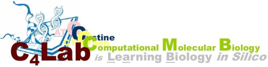
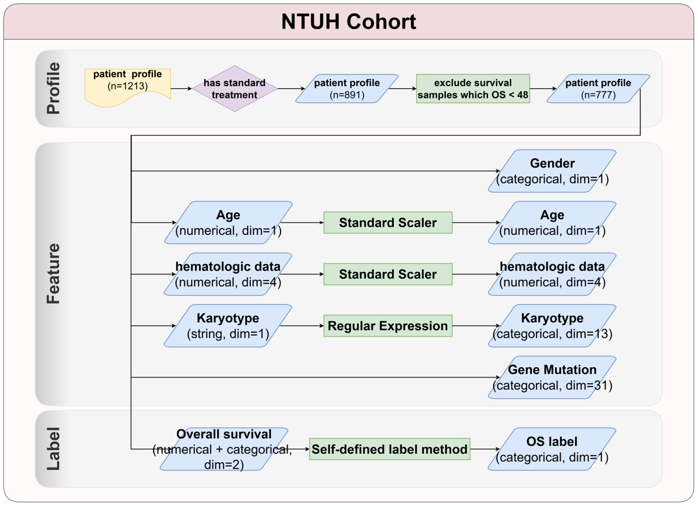

<p align="left">
  <a href="https://www.ntuh.gov.tw/ntuh/ntuhgroup.jsp" rel="noopener">
  </a>
  <a href="https://c4lab.bime.ntu.edu.tw/" rel="noopener">
  </a>
</p>


# Acute Myeloid Leukemia Risk Stratification Models

---

## 📝 Table of Contents

- [🧐 About](#about)
<!-- - [✨ Results](#results) -->
- [💊 Usage](#usage)
<!-- - [🏁 Method](#method)
- [⛏️ Model](#model) -->

<br>

---

## 🧐 About <a name = "about"></a>

This repo provides the models to stratify Acute Myeloid Leukemia patients.

The methods and result are published in [MedRxiv](https://www.medrxiv.org/content/10.1101/2024.01.08.24301018v1).

DOI: 10.1101/2024.01.08.24301018v1

<br>

---

<!-- ## ✨ Results <a name = "results"></a>

<br>

--- -->

## 💊 Usage <a name="usage"></a>

### Prerequisites
```
pip3 install -r requirements.txt
```

### Data preperation

Prepare a CSV file with the following columns. The example is shown in `./test_data/samples.csv`.:
- Sample: Unique identifier for each patient's sample.
- ELN_2022: ELN recommendations for AML, version 2022.

<!-- Clinical Features: -->
- Gender: Gender of the patient (0 for female and 1 for male).
- Age: Age of the patient.

<!-- Hematological Features: -->
- WBC: White blood cell count. (1/uL)
- Hb: Hemoglobin level in the blood. (g/dL)
- Plt: Platelet count. (10^3/uL)
- PB_Blast: Percentage of blasts in peripheral blood. (%)

<!-- Karyotype Features: Cytogenetic abnormalities. -->
- t(8;21).
- inv(16)
- t(16;16)
- t(9;11)
- t(6;9)
- t(9;22)
- t(8;16)
- inv(3)
- t(3;3)
- -5
- del(5q)
- -7
- -17

<!-- Gene Mutation Features: -->
- PTPN11
- NRAS
- KRAS
- NPM1
- FLT_TKD
- MLL
- KIT
- RUNX1
- WT1
- ASXL1
- IDH1
- IDH2
- TET2
- DNMT3A
- TP53
- SF3B1
- U2AF1
- SRSF2
- ZRSR2
- GATA2
- STAG1
- STAG2
- Rad21
- SMC1A
- SMC3
- PHF6
- CBL-b
- c-CBL
- ETV6
- EZH2
- BCOR


### Use our model to stratify your AML patients
```
python3 codes/prediction.py \
  --data_path {./test_data/samples.csv}  \
  --output_path {./results/samples.csv}
```

The results for each patient will be saved in `./results/samples.csv` at the 'esb_pred' and 'esb_eln_pred' columns.


<br>

---

<!-- ## 🏁 Method <a name = "method"></a>

### Preprocessing <a name = "preprocessing"></a>

</a>

### Model Hyperparameters Optimization <a name = "hyperparameters"></a>

### Model Training <a name = "training"></a>


<br>

---

## ⛏️ Model <a name = "model"></a>

- [Logistic Regression](https://scikit-learn.org/stable/modules/generated/sklearn.linear_model.LogisticRegression.html)
- [K Nearest Neighbor (KNN)](https://scikit-learn.org/stable/modules/generated/sklearn.neighbors.KNeighborsClassifier.html)
- [Support Vector Classification (SVC)](https://scikit-learn.org/stable/modules/generated/sklearn.svm.SVC.html)
- [Random Forest](https://scikit-learn.org/stable/modules/generated/sklearn.ensemble.RandomForestClassifier.html)
- [XGBoost](https://xgboost.readthedocs.io/en/stable/)
- [LightGBM](https://lightgbm.readthedocs.io/en/v3.3.2/)
- [1D-CNN](https://pytorch.org/docs/stable/generated/torch.nn.Conv1d.html)

 -->


